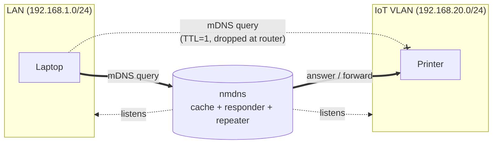
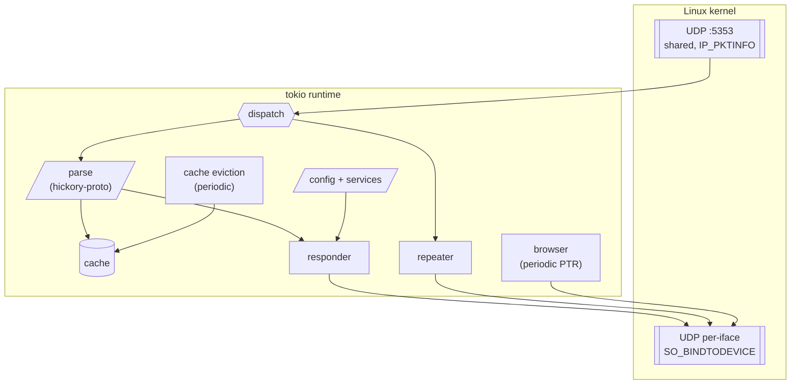
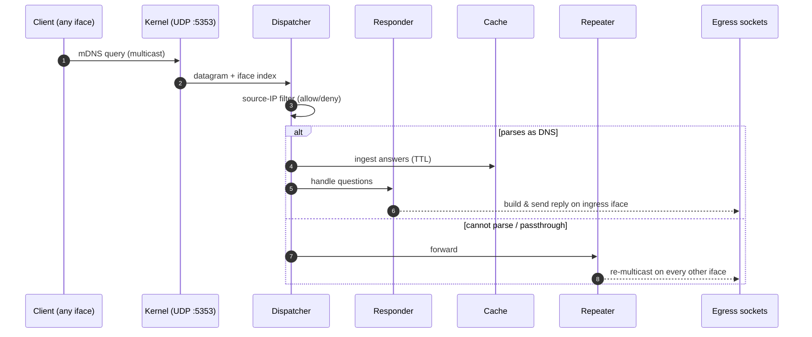
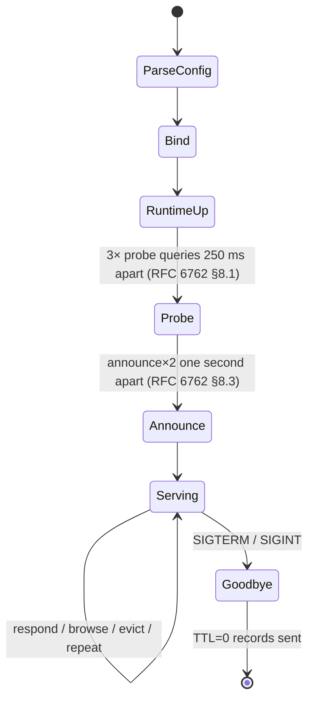

# nmdns

[](#license)
[](https://www.rust-lang.org)

An mDNS / DNS-SD daemon for Linux hosts that bridge multiple link-local
segments — routers, gateways, hypervisors, lab servers, container hosts,
or anything else with more than one network interface.

Inspired by [Apple's `mdnsd`](https://github.com/apple-oss-distributions/mDNSResponder/)
and [OpenWrt's `umdns`](https://git.openwrt.org/?p=project/mdnsd.git;a=summary). Built in Rust on top of [tokio](https://tokio.rs)
and [hickory-proto](https://crates.io/crates/hickory-proto).

> mDNS uses link-local multicast (TTL 1), so without a caching
> responder or repeater, packets never cross a router boundary.

## Features

- **Cache** — every record seen on any interface is parsed and stored
  with TTL for diagnostics, TTL tracking, and cached responses on other
  interfaces.
- **Respond** — serves `A`, `AAAA`, `PTR`, `SRV`, and `TXT` queries for
  the host's own `*.local.` name and any services declared in the config.
- **Browse** — periodically issues `PTR` queries for configured service
  types to keep the cache warm.
- **Repeat** — optionally forwards raw mDNS frames between interfaces,
  so legacy clients that don't talk to the cache still discover devices
  on other segments.
- **RFC 6762 compliant** — see [RFC 6762 compliance](#rfc-6762-compliance).
- **Hardened systemd / NixOS module** included.

## Why



A plain Layer-3 router won't forward link-local multicast, so `Laptop`
can't see `Printer`. `nmdns` listens on both segments and either
replies on the printer's behalf (for services it has been configured
to publish) or re-multicasts the frame onto the other link.

## Install

### From source

```sh
cargo build --release
sudo install -Dm755 target/release/nmdns /usr/local/bin/nmdns
sudo install -Dm644 man/nmdns.8 /usr/local/share/man/man8/nmdns.8
```

### Nix flake

```sh
nix build           # produces ./result/bin/nmdns
```

The flake also exposes `nixosModules.default` (see
[NixOS module](#nixos-module)).

## Quick start

1. Drop a config at `/etc/nmdns.toml` — start from
   [examples/nmdns.toml](examples/nmdns.toml).
2. List the interfaces you want to bridge:

   ```toml
   interfaces = ["br-lan", "br-iot"]
   repeat     = true

   [[service]]
   name    = "Router Admin"
   service = "_http._tcp.local."
   port    = 80
   txt     = ["path=/"]
   ```

3. Validate, then run:

    ```sh
    sudo nmdns --check                  # parse + exit
    sudo nmdns                          # run in foreground
    ```

`nmdns` must start with permission to bind UDP port 5353 and use
`SO_BINDTODEVICE` — root, or an unprivileged user holding
`CAP_NET_BIND_SERVICE` and `CAP_NET_RAW` (the included NixOS module
and systemd unit run the daemon under an unprivileged `nmdns` user
with ambient capabilities; no in-process privilege drop is performed).

## Usage

```
nmdns [-c PATH] [--check]
```

| Flag       | Description                                          |
|------------|------------------------------------------------------|
| `-c PATH`  | Path to the TOML config (default `/etc/nmdns.toml`). |
| `--check`  | Parse and validate the config, then exit.            |
| `-h`       | Show help.                                           |

### Exit Codes

| Code | Meaning |
|------|---------|
| `0`  | Success. |
| `2`  | Command-line usage error emitted by `clap`. |
| `10` | Config file load, parse, or structural validation failed. |
| `11` | Semantic `--check` validation failed, such as an invalid DNS name. |
| `14` | Tokio runtime creation failed. |
| `20` | Network interface/socket setup failed. |
| `22` | Service record construction failed during runtime startup. |

A man page is included at [man/nmdns.8](man/nmdns.8):

```sh
man man/nmdns.8            # GNU man (Linux)
mandoc man/nmdns.8         # mandoc (BSD / macOS)
```

## Configuration

All runtime behaviour lives in the TOML config. See
[examples/nmdns.toml](examples/nmdns.toml) for a fully-commented
reference.

### Top-level keys

| Key                    | Type            | Default          | Notes                                              |
|------------------------|-----------------|------------------|----------------------------------------------------|
| `interfaces`           | list of strings | _required_       | Interfaces to listen / respond on.                 |
| `repeat`               | bool            | `true`           | Forward unparsed mDNS between interfaces.          |
| `answer_from_cache`    | bool            | `true`           | Answer queries from records learned on other interfaces. |
| `hostname`             | string          | system hostname  | Advertised as `<hostname>.local.`.                 |
| `blacklist`            | list of CIDRs   | `[]`             | Drop packets from these IPv4/IPv6 source nets.     |
| `whitelist`            | list of CIDRs   | `[]`             | If non-empty, only accept these IPv4/IPv6 nets.    |
| `browse`               | list of names   | `[_services._dns-sd._udp.local.]` | Service types to actively browse.          |
| `browse_interval_secs` | int             | `60`             | Seconds between browse rounds.                     |
| `cache_tick_secs`      | int             | `5`              | Cache eviction tick.                               |
| `max_cache_entries`    | int             | `4096`           | Cache capacity; nearest-to-expiry evicted on full. |
| `cache_max_ttl_secs`  | int             | _unset_ (no cap) | Cap cached record TTLs to this many seconds. Limits cache-poisoning persistence on cross-interface bridges. |
| `[[service]]`          | tables          | `[]`             | DNS-SD instances to publish (see below).           |

### Publishing services

Each `[[service]]` block publishes one DNS-SD instance:

```toml
[[service]]
name    = "Office Printer"      # instance name
service = "_ipp._tcp.local."    # service type
port    = 631
txt     = ["rp=ipp/print"]      # optional TXT entries
# host  = "printer.local."      # optional, default = daemon hostname
```

The daemon emits the corresponding `PTR`, `SRV`, `TXT`, `A`, and `AAAA`
records on startup (probes then announces; RFC 6762 §8.1 / §8.3) and replies
to matching queries while running. On `SIGTERM` / `SIGINT` it sends
"goodbye" packets with TTL 0 (RFC 6762 §10.1).

### Source filters

`blacklist` and `whitelist` are mutually exclusive and apply to both
the responder and the repeater.

```toml
whitelist = ["192.168.10.0/24", "192.168.20.0/24", "fe80::/10"]
```

### Cached responses

When `answer_from_cache = true`, queries can be answered from records
previously learned on another managed interface. This lets the daemon act
as a cache-backed responder even when `repeat = false`; the active browser
keeps common DNS-SD service records warm by default.

Cached answers are not sent back onto the same interface where the record
was learned, since devices on that link can answer for themselves.

### Cache poisoning mitigation

When `answer_from_cache` is enabled, records learned on one interface are
served to clients on other interfaces. A malicious device on any monitored
link can inject arbitrary DNS records that propagate across all bridges.

Set `cache_max_ttl_secs` to cap how long cached records persist — for
example, `cache_max_ttl_secs = 300` limits even a DNS-SD service record
(whose default TTL is 4500 s / 75 min) to 5 minutes. This is a security
trade-off: lower caps reduce the poisoning window but also shorten the
lifetime of legitimate long-lived records. Values must be between 1 and
4294967295; `0` (or leaving the key unset) means "no cap" and preserves
original TTLs.

## NixOS module

The flake exposes a NixOS module:

```nix
{
  inputs.nmdns.url = "path:/path/to/nmdns";
  outputs = { self, nixpkgs, nmdns }: {
    nixosConfigurations.gateway = nixpkgs.lib.nixosSystem {
      modules = [
        nmdns.nixosModules.default
        ({ ... }: {
          services.nmdns = {
            enable = true;
            interfaces = [ "br-lan" "br-iot" ];
            openFirewall = true;
            services = [
              { name = "Web UI"; service = "_http._tcp.local."; port = 80; txt = [ "path=/" ]; }
              { name = "SSH";    service = "_ssh._tcp.local.";  port = 22; }
            ];
          };
        })
      ];
    };
  };
}
```

The module renders `/etc/nmdns.toml` from typed options and starts a
hardened systemd unit. Use `services.nmdns.settings` for any keys not
exposed as typed options.

## Architecture

### Components



- One shared IPv4 receive socket bound to `0.0.0.0:5353` with
  `IP_PKTINFO`, plus one shared IPv6 receive socket bound to `[::]:5353`
  with IPv6 packet info when any monitored interface has IPv6.
- IPv4 multicast uses `224.0.0.251:5353`; IPv6 multicast uses
  `ff02::fb:5353` scoped to the receiving/sending interface.
- One send socket per interface address family, bound with
  `SO_BINDTODEVICE` on Linux, so replies and announcements egress on the
  right link.
- `hickory-proto` handles DNS message parsing and encoding only; the
  cache, responder, and DNS-SD logic live in this crate.

### Packet life cycle



### Startup & shutdown



## RFC 6762 compliance

Each implemented rule has a dedicated test in
[tests/rfc6762.rs](tests/rfc6762.rs) whose name encodes the section
number, so a regression points straight at the violated rule.

| RFC §  | Rule                                                                        | Status |
|--------|-----------------------------------------------------------------------------|--------|
| §3     | Hostnames are `<single-label>.local.`                                       | ✓      |
| §3     | IPv6 mDNS multicast address is `ff02::fb`                                   | ✓      |
| §5.2   | Browser: 20–120 ms initial jitter before the first query                    | ✓      |
| §5.2   | Browser: successive query intervals double, capped at `browse_interval_secs`| ✓      |
| §6     | Unique-answer / probe-defense responses sent without delay                  | ✓      |
| §6     | Shared / multi-question responses delayed 20–120 ms                         | ✓      |
| §6     | TC-bit (truncated query) responses delayed 400–500 ms                       | ✓      |
| §6     | Per-(record, interface) 1 s minimum multicast interval                      | ✓      |
| §6     | Per-(AAAA record, interface) 1 s minimum multicast interval                 | ✓      |
| §6     | Probe-defense uses reduced 250 ms interval                                  | ✓      |
| §7.1   | Known-Answer Suppression: fresh known-answers are dropped                   | ✓      |
| §7.1   | Known-Answer Suppression applies to AAAA records                            | ✓      |
| §7.1   | Known-Answer Suppression: stale known-answers (TTL < ½) are kept            | ✓      |
| §8.1   | Probe: 0–250 ms initial random jitter                                       | ✓      |
| §8.1   | Probe: three probes 250 ms apart                                            | ✓      |
| §8.1   | Probe message format (qtype=ANY, QU bit, Authority Section)                 | ✓      |
| §8.1   | Incoming probes detected by Authority-Section records                       | ✓      |
| §8.1   | Incoming AAAA probes detected by Authority-Section records                  | ✓      |
| §8.3   | Announcement gap ≥ 1 s                                                      | ✓      |
| §10.1  | Goodbye records carry TTL = 0                                               | ✓      |
| §10.1  | Goodbye records include published AAAA records                              | ✓      |
| §10.1  | Receiver: TTL = 0 evicts the matching cache entry                           | ✓      |
| §10.2  | Cache-flush bit on unique records; not on shared PTR                        | ✓      |
| §10.2  | Cache-flush bit on host AAAA records                                        | ✓      |
| §11    | Source-address filter (CIDR blacklist / whitelist)                          | ✓      |
| §11    | IPv6 source-address filter (CIDR blacklist / whitelist)                     | ✓      |
| §11    | IP TTL = 255 on outgoing mDNS sockets                                       | ✓      |
| §18.4  | Authoritative Answer bit set on responses                                   | ✓      |
| §8.2   | Simultaneous-probe lexicographic tiebreaking & rename-on-conflict           | ✗      |
| §6.1   | NSEC negative responses                                                     | ✗      |
| §7.2   | Multi-packet Known-Answer aggregation (TC continuation)                     | ✗      |

Run the suite:

```sh
cargo test --test rfc6762
```

## Limitations

- IPv6 support uses link-local interface addresses. Interfaces may be
  IPv4-only, IPv6-only, or dual-stack, but IPv6 publishing requires a usable
  link-local address on the configured interface.
- No full conflict resolution (RFC 6762 §8.2 lexicographic tiebreaking).
  The daemon assumes its hostname is unique on the link; probes are
  sent so other hosts can defer to it.
- No periodic re-announcement timer; announces on startup and on
  (re)load only.

## Development

```sh
cargo build                 # debug build
cargo test                  # full test suite
cargo test --test rfc6762   # RFC 6762 conformance only
cargo clippy --all-targets
```

## License

Licensed under either of

- Apache License, Version 2.0 ([LICENSE-APACHE](LICENSE-APACHE))
- MIT license ([LICENSE-MIT](LICENSE-MIT))

at your option.
